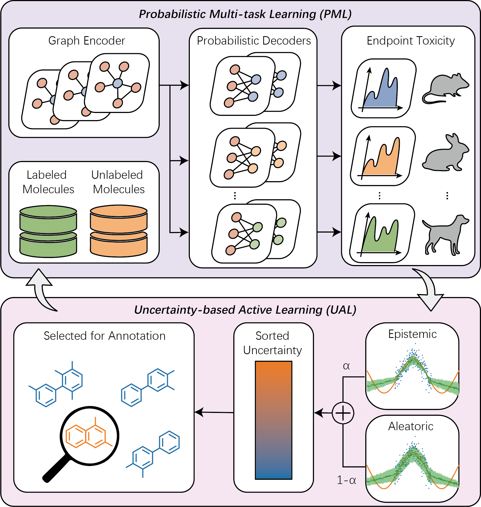

# PMAL

PyTorch implementation of "A Multitask Active Learning Framework with Probabilistic Modeling for Multi-Species Acute Toxicity Prediction".

<div align="center">
  
</div>

## Setup
The following dependencies are recommended for the installation of the environment.

- python 3.8.18
- torch 1.8.1
- torch geometric 2.2.0

See requirements.txt for the detailed list of dependencies.

**Note for Graph Transformer** This project utilizes **Cython** to accelerate complex graph algorithms (e.g., Floyd-Warshall for
spatial positioning). You **must** compile the C extensions locally before running this repo on Graph Transformer.
Run the following command in the root directory:
```bash
python setup.py build_ext --inplace
```
*Note:* If successful, you will see `.so` (Linux/Mac) or `.pyd` (Windows) files generated in the `algos/` directory.

## Dataset
It is recommended to download the following datasets from the official website:

- MoleculeNet: https://moleculenet.org/
- ToxAcute: https://toxric.bioinforai.tech/

, and place them in the "pmal/data/xxx.csv" directory.

## Training and Testing
For training and testing, use the following script:

python main.py --gpu_id 0 --dataset toxacute --arch GCN --weighting EW --switch on --sampling PMAL --n_round 4

## Citation
If you find our work useful in your research please consider citing our paper:
```
@article{han2026multitask,
  title={A Multitask Active Learning Framework with Probabilistic Modeling for Multi-Species Acute Toxicity Prediction},
  author={Han, Tianyu and Wang, Jingjing and Zhao, Yanpeng and Lin, Ying and Yu, Lu and He, Song and Zan, Peng and Bo, Xiaochen},
  journal={Molecules},
  volume={31},
  number={7},
  pages={1144},
  year={2026},
  publisher={MDPI}
}
```
